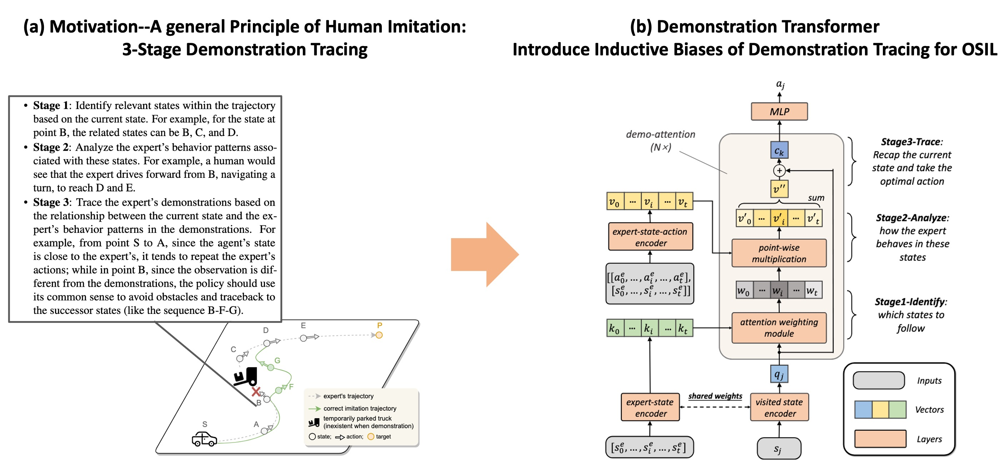
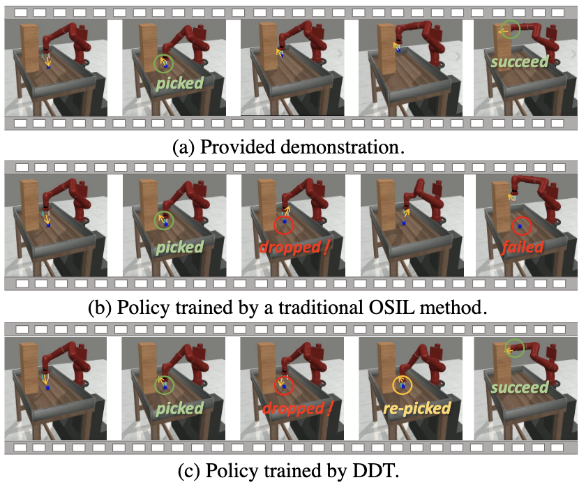
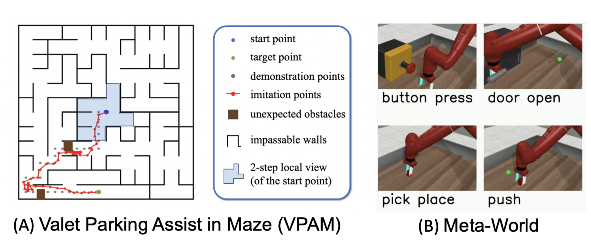
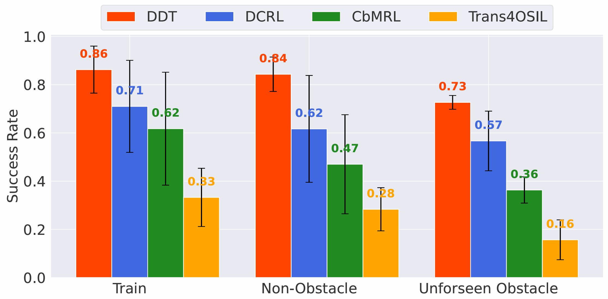
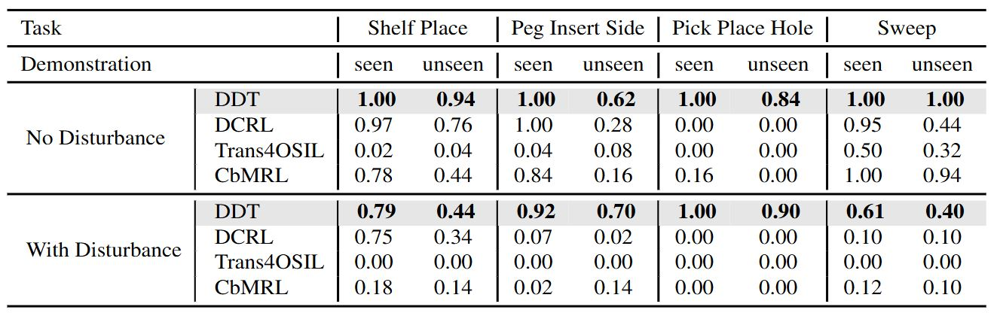

# Deep-Demonstration-Tracing

The  Official Code of "Deep Demonstration Tracing: Learning Generalizable Imitator Policy for Runtime Imitation from a Single Demonstration" (ICML'24). Visit our project page [OSIL](https://osil-ddt.github.io/) for more information.

<div style="display: flex; justify-content: center; gap: 5px;">
    
    
</div>

## 🔧 quick start

Step1: We offer code for VPAM and Metaworld environment. You can download demo dataset from [Google Drive](https://drive.google.com/drive/folders/1-e5ujp7Gl2PAE3IECGRu7_fgKOvZfKlH?usp=sharing) to `.data`

<!-- <div style="display: flex; justify-content: center; gap: 5px;">
    
</div> -->

Step2: install related packages

```
conda create -n ddt python=3.10
pip install -r requirements.txt
```

install environments

```
cd envs/gym_continuous_maze
pip install -e .
```

install experiments management tool RLAssitant

```
git clone https://github.com/polixir/RLAssistant.git
cd RLAssistant
pip install -e .
```

## 🚀 Run experiments
We validate the performance of DDT in both VPAM and Metaworld, which shows significantly better performance than the baselines with unforseen obstacle or without obstacle. Part of the results are as follows:

<div style="display: flex; justify-content: center; gap: 10px;">
    
    
</div>

You can run DDT with the following command. For maze environment, the default config can be found in "configs/maze_mt.yaml". For Metaworld environment, the default config can be found in "configs/metaworld_mt.yaml".
* Maze: 
```bash
python main_ddt.py --device cuda:0 --benchmark maze
``` 
* Metaworld: 
```bash
python main_ddt.py --device cuda:0 --benchmark metaworld
``` 